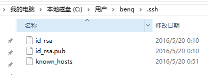

###git命令集合
```
history  `查看你敲的历史命令`
cd d/     `转到某个盘符或者文件夹`
mkdir    `创建文件夹`
git  init   `初始化git`
git  clone `克隆一个仓库 例：git clone git@github.com:benq1987/react-demos.git`
touch xxx.xx `创建一个文件，例：touch README.md`
git  add  `命令可将文件添加到缓存，例：git add README.md，添加所有可以这样：git add -A 或 git add *`
git status `可以查看当前版本库各个文件的状态`
git checkout  `撤销之前的add`
git commit  `git commit -m '第一次版本提交'`
git reset  `git reset HEAD 命令用于取消已缓存的内容。例：$ git reset HEAD -- hello.php`
dir  `查看当前目录下有什么文件夹或者文件`
cat   	`例： cat ~/ssh/README.md`
git remote add origin  `git remote add origin 你的github上的仓库地址 例：git remote add origin git@github.com:benq1987/react-demos.git`
git log  `看版本信息等`
git remote -v `查看你提交仓库地址`
git push origin master  `将本地的代码push到远程仓库`
git pull origin master  `将远程的代码pull到本地并且做合并操作`
--hlep  `例：git commit --hlep,打开命令相应的帮助文档`
```


###配置alias别名

``` python
$ git config --global alias.st status
$ git config --global alias.ci commit
$ git config --global alias.co checkout
$ git config --global alias.br branch
$ git config --global alias.lg "log --color --graph --pretty=format:'%Cred%h%Creset -%C(yellow)%d%Creset %s %Cgreen(%cr) %C(bold blue)<%an>%Creset' --abbrev-commit"
```

###设置public key
首先需要在本地生成key，并且把key配置在github上
生成key命令如下：
```
$ ssh-keygen -t rsa -C "cb8787cbq@qq.com"
```


像这样生成一个公钥一个私钥，使用nodepad++等编辑器打开id_rsa.pub这个文件,复制出来,然后到你githup右上角点击头像-> 点击settings-> 点击SSH KEYS-> 点击ADD SSH KEYS-> 将获取的public key粘贴于此。

###npm命令
使用安装前：先设置一下镜像源地址和loglevel
```
$ npm config set registry http://registry.npm.taobao.org
$ npm config set loglevel=http
```
```
npm install 模块名 -g --save --save -dev  `--save 版本名和版本号记录在dependencies字段 --save-dev 版本名和版本号记录在devDependencies字段`
npm ls -g `查看全局安装的模块`
npm uninstall express  `卸载模块`
npm ls  `查看模块是否存在`
npm update express `更新模块`
```
常用命令
>NPM提供了很多命令，例如install和publish，使用npm help可查看所有命令。
使用npm help 可查看某条命令的详细帮助，例如npm help install。
在package.json所在目录下使用npm install . -g可先在本地安装当前命令行程序，可用于发布前的本地测试。
使用npm update 可以把当前目录下node_modules子目录里边的对应模块更新至最新版本。
使用npm update -g可以把全局安装的对应命令行程序更新至最新版。
使用npm cache clear可以清空NPM本地缓存，用于对付使用相同版本号发布新版本代码的人。
使用npm unpublish @可以撤销发布自己发布过的某个版本代码。
